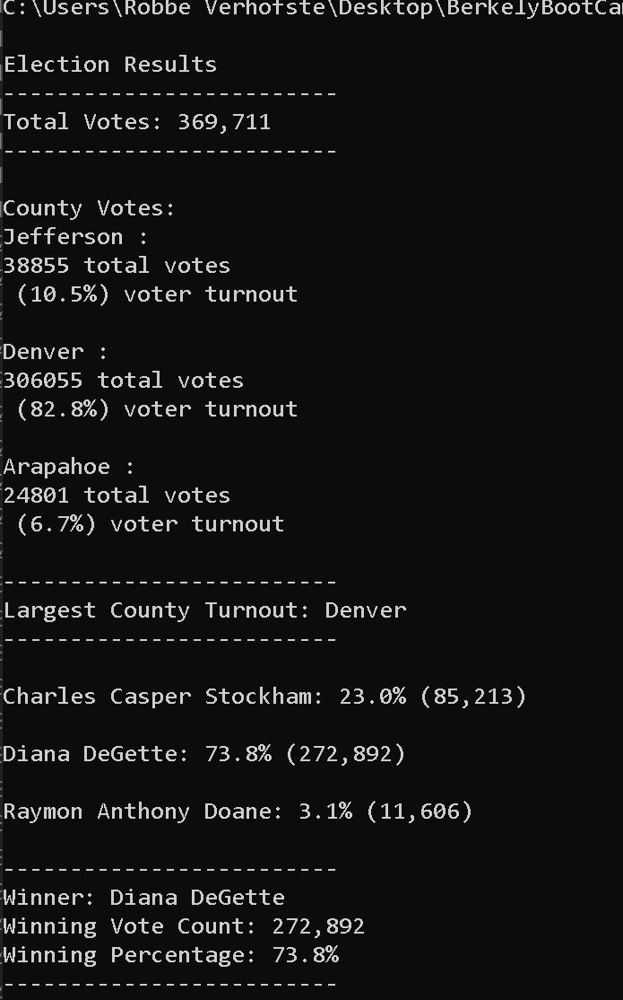

# Election-Analysis-

## Project Overivew
A Colorado Board of Elections employee has given you the following tasks to complete the election audit of a recent local congressional election. 

1. Calculate the total number of votes cast
2. Get a complete list of candidates who received votes
3. Calculate the total number of votes each candidate received
4. Calculate the percentage of votes each candidate won
5. Determine the winner of the election based on popular vote

## Resources
* Data Source: election_results.csv
* Software: Python 3.6.1, Visual Studio Code, 1.38.1

## Results
The analysis of the election show that:
* There were 360,711 votes cast in the election.
* The candidates were:
 * Charles Casper Stockham: 23.0% (85,213)

 * Diana DeGette: 73.8% (272,892)

 * Raymon Anthony Doane: 3.1% (11,606)

  * The winner of the eletion was:
    * Winner: Diana DeGette
    * Winning Vote Count: 272,892
    * Winning Percentage: 73.8%

County Votes:
  Jefferson : 
  38855 total votes
   (10.5%) voter turnout

  Denver :
  306055 total votes
   (82.8%) voter turnout

  Arapahoe :
  24801 total votes
   (6.7%) voter turnout

  -------------------------
  Largest County Turnout: Denver
  
### Outputs
     Terminal Output

    

  
## Audit-Summary
This script can be used to audit election results anytime that data is collected in a .csv format. The results can include additional number of counties or additional number of candidates.
If time or type of voting is included in the data (mail-in, absentee, in-person), these components can be further analyzed to determine where each candidate performed best.
  
## Challenge Summary
This script is designed to be re-used for future elections. The script contains variables, lists, and dictionaries for county data and for candidate data. These can be used used at multiple scales (city, county, state, national). 
